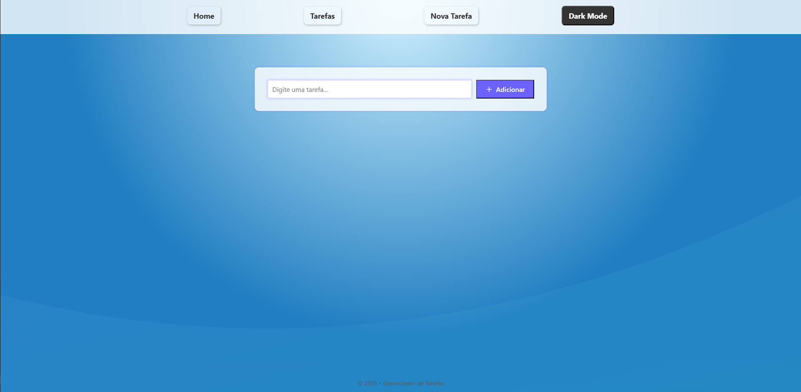
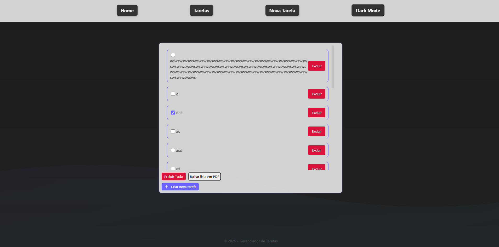
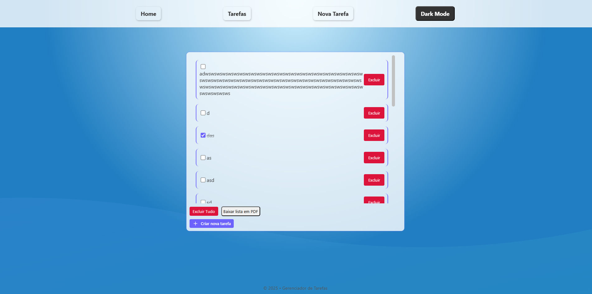
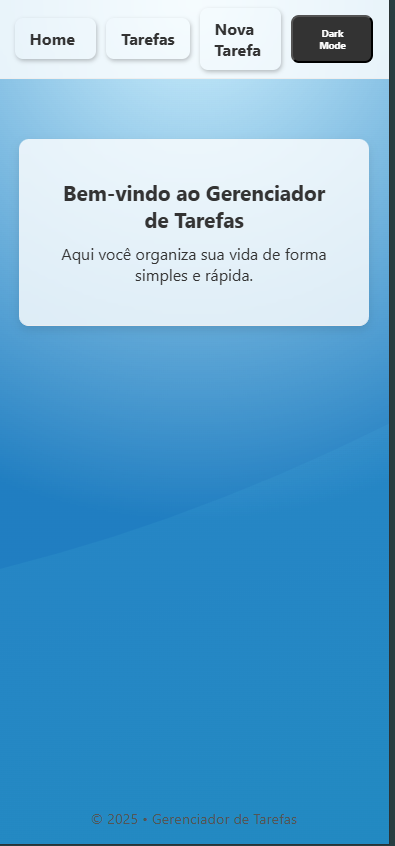

# 📝 Todo List - React

Aplicação de lista de tarefas desenvolvida com React, focada em organização, produtividade e responsividade.

---

## 🚀 Funcionalidades

- ✅ Adicionar tarefas
- ✏️ Marcar tarefas como concluídas
- 🗑️ Remover tarefas
- 🌙 Modo claro e escuro
- 📱 Layout responsivo (mobile e desktop)
- 📄 Exportar lista em PDF

---

## 🖼️ Preview

### 💻 Desktop






### Mobile



---

## 🛠️ Tecnologias utilizadas

- React
- Vite
- React Router DOM
- CSS Modules
- JavaScript
- HTML5

---

## ▶️ Como rodar o projeto

```bash
# Clone o repositório
git clone https://github.com/philipeelopes/todo-list.git

# Entre na pasta
cd todo-list

# Instale as dependências
npm install

# Rode o projeto
npm run dev 
